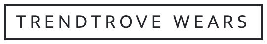

<a id="readme-top"></a>

<!-- PROJECT LOGO -->
<br />
<div align="center">
  <a href="https://github.com/github_username/repo_name">
    
  </a>

<h3 align="center">Trendtrove Wears</h3>

  <p align="center">
    TrendTroove is a functional and user-friendly B-2-C e-commerce app designed to provide a seamless shopping experience for customers with robust administrative capabilities.
    <br />
    <a href="https://github.com/techemmy/TrendTrove-Wears/blob/main/README.md"><strong>Explore the docs »</strong></a>
    <br />
    <br />
    ·
    <a href="https://trendtrovewears.onrender.com/">Visit website</a>
    ·

  </p>
</div>


<!-- TABLE OF CONTENTS -->
<details>
  <summary>Table of Contents</summary>
  <ol>
    <li>
      <a href="#about-the-project">About The Project</a>
      <ul>
        <li><a href="#built-with">Built With</a></li>
      </ul>
    </li>
    <li>
      <a href="#getting-started">Getting Started</a>
      <ul>
        <li><a href="#prerequisites">Prerequisites</a></li>
        <li><a href="#installation">Installation</a></li>
      </ul>
    </li>
    <li><a href="#contact">Contact</a></li>
  </ol>
</details>


<!-- ABOUT THE PROJECT -->
## About The Project

TrendTrove Wears is a functional and user-friendly B-2-C e-commerce app designed to provide a seamless shopping experience for customers with robust administrative capabilities. It sells clothing and wears for different categories (Men, Women and Children).
<div>
    
</div>


## Summary of the features
- Authentication and Authorization: Utilizing Password Auth & OAuth for secure user access control.

- Responsive Front-end: A mobile & desktop responsive front-end interface for effortless customer interaction.

- Product Inventory: Browse and add a wide range of clothing and wear items to your cart.

- Efficient Search: Search functionality for finding products quickly and easily.

- Pagination: Smooth navigation through product listings with pagination.

- Advanced Filters: Refine your product search by categories, price range, size, and the latest arrivals

- Sorting Options: Sort products alphabetically (descending or ascending), and by price (high to low or low to high).

- Shopping Cart: Conveniently manage items you wish to purchase.

- Seamless Checkout: Streamlined checkout process for a hassle-free buying experience.

- Coupon Discounts: Apply coupons to enjoy discounts on your cart total

- Payment Integration: Secure Stripe payment integration to complete your purchase

- User Profiles: Personalized profiles for customers to track order history, save shipping details, and manage preferences.

- Admin Interface: An intuitive admin panel to manage orders, product listings and coupons effortlessly (view, add, modify, and delete).

- Wishlist: Giving users the option to add items to a wishlist for future purchases can encourage repeat visits and purchases.

- Email Notification System: Admin users get mailed whenever there's a successful payment. Customers and admin users get mailed an invoice after their order gets processed by the admin.

<p align="right">(<a href="#readme-top">back to top</a>)</p>


### Built With

- 
- 
- 
- 
- 
- 
- 
- 
- 
- 
- 


<p align="right">(<a href="#readme-top">back to top</a>)</p>


<!-- GETTING STARTED -->
## Getting Started

This section will guide you on how to get the app running on your local machine

### Prerequisites

Here's a list of all the softwares you need to install
- [NodeJs v18](https://nodejs.org/dist/v18.16.0/) for running app
- [PostgreSQL](https://www.postgresql.org/download/) for the database

To use the enable the mailer system, make sure you create an App password on google and update the `MAILER_USER` with your email and `MAILER_PASSWORD` with the new app's password.


### Installation
1. Clone the repo
   ```sh
   https://github.com/techemmy/TrendTrove-Wears.git
   ```
2. Enter the project directory
    ```sh
    cd Trendtrove-Wears
    ```
3. Copy the `.example.env` file into `.env` fill it appropriately
    ```sh
    cp .example.env .env
    ```
4. Install NPM packages
   ```sh
   npm install
   ```
5. Make sure you have your PostgreSQL server running
6. Start the development server
   ```js
   npm run dev
   ```

<p align="right">(<a href="#readme-top">back to top</a>)</p>


<!-- CONTACT -->
## Contact

Emmanuel Oloyede - [@itechemmy](https://twitter.com/@itechemmy) - emmanueltopea@gmail.com

Project Link: [https://github.com/techemmy/trendTrove-Wears/](https://github.com/techemmy/trendTrove-Wears/)


<p align="right">(<a href="#readme-top">back to top</a>)</p>
